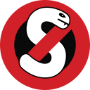

<!--
Copyright (C) 2005-2024 Giorgio Maone <https://maone.net>

SPDX-License-Identifier: GPL-3.0-or-later
-->

[][Website]
# NoScript Security Suite

*Free and Open Source Software providing extra protection for various browsers.*

[![Badge Release]][Releases] [![Badge License]][License] [![Button Website]][Website]

## Download
[![Badge Firefox]](https://addons.mozilla.org/en-US/firefox/addon/noscript)
[![Badge Chromium]](https://chromewebstore.google.com/detail/noscript/doojmbjmlfjjnbmnoijecmcbfeoakpjm)

## Security Reports

We strive to fix security sensitive issues in the shortest time possible, usually in hours, while protecting users at the same time.

Please report these issues privately to **[security@noscript.net](mailto:security@noscript.net)**. To ensure confidentiality, please encrypt your report with this **PGP key**:

```
3359 0391 70A3 CD9B 25CF 5A46 231A 83AF DA9C 2434
```

</div>

<!----------------------------------------------------------------------------->
[Releases]: https://github.com/hackademix/noscript/releases
[Website]: https://noscript.net

[License]: LICENSE
<!----------------------------------[ Badges ]--------------------------------->
[Badge Release]: https://img.shields.io/github/v/release/hackademix/noscript?style=for-the-badge&labelColor=569A31&color=407225&logo=GitLFS&logoColor=white
[Badge License]: https://img.shields.io/badge/License-GPL3+-015d93.svg?style=for-the-badge&labelColor=blue&logo=GNU&logoColor=white

[Badge Firefox]: https://img.shields.io/badge/Firefox-e86434.svg?style=for-the-badge&logo=FirefoxBrowser&logoColor=white
[Badge Chromium]: https://img.shields.io/badge/Chromium-4285F4.svg?style=for-the-badge&logo=GoogleChrome&logoColor=white
<!---------------------------------[ Buttons ]--------------------------------->
[Button Website]: https://img.shields.io/badge/Ｗｅｂｓｉｔｅ-d12027?style=for-the-badge&logo=ONLYOFFICE&logoColor=white
